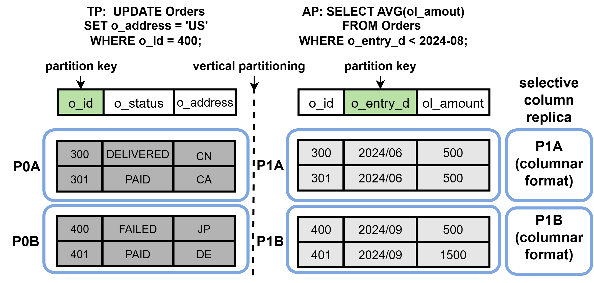

<div align= "center">
    <h1>Jasper</h1>
</div>

<p align="center">
  <a href="#0-description">Description</a> •
  <a href="#1-setup">Setup</a> •
  <a href="#2-configuration">Configurations</a> •
  <a href="#3-run">Run</a> •
</p>

Jasper is a joint adaptive storage framework for HTAP systems. Jasper jointly optimizes *horizontal and vertical partitioning* along with *selective column store* configuration. We propose *MCTS-HTAP*, a workload-aware search algorithm that integrates with a lightweight, data synchronization aware *evaluation model* to estimate both query execution time and synchronization overhead. Moreover, Jasper supports incremental configuration updates, allowing the system to adapt to workload changes without significant performance disruption.

## 0. Description

Jasper includes both row and column stores. It captures workload characteristics to construct optimal data partitions and selectively configures column store replicas for certain partitions without compromising data freshness.

As illustrated in the figure , consider an e-commerce scenario with two representative workloads over the *Orders* table: transactions update the address field, and analytical queries calculate the average order amount.

Based on workload analysis, our mechanism partitions data accordingly and selectively creates column store replicas for analytical hot spots.

For instance, updates target partition *P0B* stored only in row format, avoiding interference with analytics. Analytical queries are served from *P1A*, a column store partition optimized for filtering and aggregation.

<div align="center">


**Figure 1.** Illustration of Jasper
</div>


## 1. Setup

### DB Cluster

We implement Jasper on TiDB, an open-source commercial HTAP database system. We recommend to install and deploy TiDB with:

[Deploy a local test cluster (for macOS and Linux)](https://docs.pingcap.com/tidb/stable/quick-start-with-tidb/#deploy-a-local-test-cluster)

[Simulate production deployment on a single machine (for Linux only)](https://docs.pingcap.com/tidb/stable/quick-start-with-tidb/#simulate-production-deployment-on-a-single-machine)

### Requirements

TiUP: ​​TiUP is the component manager for the TiDB ecosystem, providing one-click deployment, upgrade, and management of TiDB clusters and related tools.

mysql.connector: ​​mysql.connector is the official Python driver for MySQL, enabling database interactions through a pure Python implementation with support for transactions, connection pooling, and compatibility with MySQL protocols.​

## 2.Configuration

Jasper configurations can be changed in the config.py file. Here we list several most important ones. You can adjust the relevant parameters based on the deployment situation.

```bash
self.TIDB_HOST=''
self.TIDB_PORT=''
self.TIDB_USER=''
self.TIDB_PASSWORD=''
self.TIDB_DB_NAME=''
```

## 3. Run

### Test Jasper

Step 1: Change the settings within ./dev/config.py.

Step 2: Run the test script to get the performance.

```bash
python test_advisor.py
```

### Run MCST-HTAP

Step 1: Change the settings within ./dev/config.py.

Step 2: Run the search script with evaluation model.

```bash
python advisor.py
```


